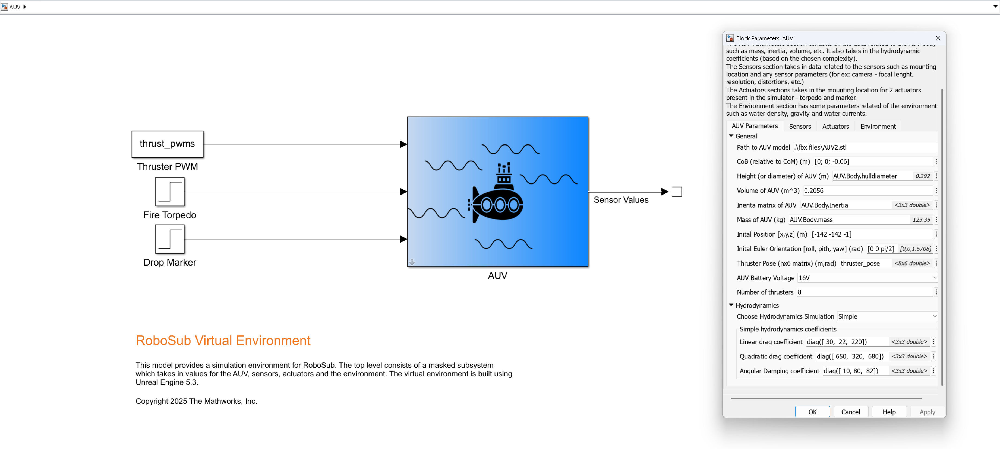
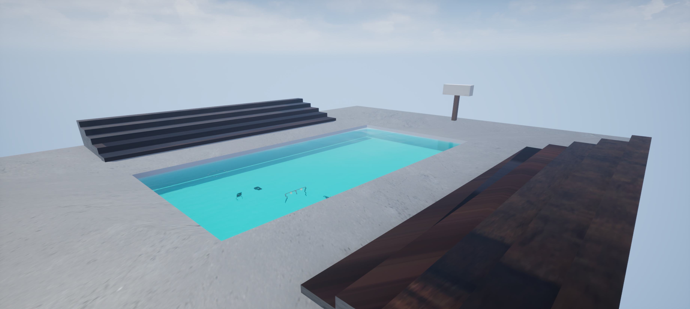

# RoboSub Virtual Environment

This repository contains the Simulink&reg; model and associated files for a robosub virtual environment. [RoboSub](https://robosub.org/) is an annual autonomous underwater vehicle (AUV) competition held by [RoboNation](https://robonation.org/). The model allows the user to define propoerties of their AUV such as mass, volume, drag coefficients, thruster configuration, etc. and simulates the hydrostatic and hydrodynamics forces acting on the AUV. It also simulates sensor readings and actuator control. This allows users to simulate tasks seen in RoboSub such as navigating through a gate, octagon surface, torpedo and dropper marker tasks. The model uses MATLAB&reg; 2025b and Unreal Engine&reg; 5.3.

| Simulink model | Virtual environment |
| :------------: | :-----------------: |
|  |  |

The Simulink model comprises of 4 subsystems - AUV Dynamics, Sensors, Actuators and Visualization. The dynamics subsystem calculates the hydrostatic and hydrodynamic forces on the AUV and calculates the forces due to the thrusters. The sensors subsystem simulates a DVL, an IMU and one forward and one downward facing cameras that can also output depth data. The actuator subsystem simulates a torpedo and a marker dropper requried for the associated tasks. The visualization subsystem contains 3D animation blocks to load the virtual environment and update the location of the actors.

|Roll stability | CoB offset | Positive buoyancy|
| :-------------: | :----------: | :-----------------:|
|  |  | 

The gifs above show the results of the dynamics for various scenarios such as roll stability when center of buoyancy is above center of mass (left), submarine orientation when center of buoyancy is offset in the y-axis (middle) and a positively buoyant vehicle.

## Getting Started

To get started, follow these steps

* Download the environment executable from [this link](https://mathworks-my.sharepoint.com/:f:/p/abshanka/IgAVU4YM8sTWTJGqBX9ymXzJAShROga7U6-v4d0ud20T85E?e=WISkc3)
* Clone the repo to your local folder. Open the project file - virtual_robosub.prj.
* Navigate to the visualization block under the masked subsystem (AUV). You can open it by right clicking on the subsystem and choose 'Look under mask' or use the shortcut ctrl+U.
* Open Simulation 3D Scene configuration block and in the Project Folder parameter, enter the location of the executable (yourFolder/RoboSub_pool_25b/Windows/AutoVrtlEnv.exe) downloaded in step 1(note: the first time you open it, it'll show an error, you can ignore it and press 'ok' as it will be resovled after adding the location of the executable file)
* The AUV mask is filled with some default values but these can be customized to match the model required
* Press the 'Run' button to run the simulation. The simulation stop time is set to infinity which means the user decides when to stop.

More information can be found in [RoboSub Virtual Environment.pdf](<./RoboSub Virtual Environment.pdf>)

For questions or clarifications please contact roboticsarena@mathworks.com

## Requirements

The model has the following dependencies

* [MATLAB® 2025b](https://www.mathworks.com/products/new_products/latest_features.html)
* [Simulink&reg;](https://www.mathworks.com/products/simulink.html)
* [Robotics Systems Toolbox&trade;](https://www.mathworks.com/products/robotics.html)
* [ROS Toolbox](https://www.mathworks.com/products/ros.html)
* [Aerospace Blockset&trade;](https://www.mathworks.com/products/aerospace-blockset.html)
* [Simulink&reg; 3D Animation&trade;](https://www.mathworks.com/products/3d-animation.html)
* [Sensor Fusion and Tracking Toolbox&trade;](https://www.mathworks.com/products/sensor-fusion-and-tracking.html)

## License
The license is available in the License.txt file in this GitHub repository.

## Community Support
[MATLAB Central](https://www.mathworks.com/matlabcentral)

Copyright 2025 The MathWorks, Inc.